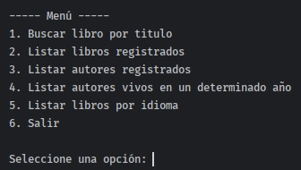
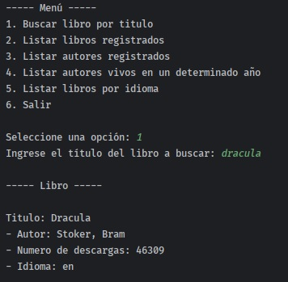
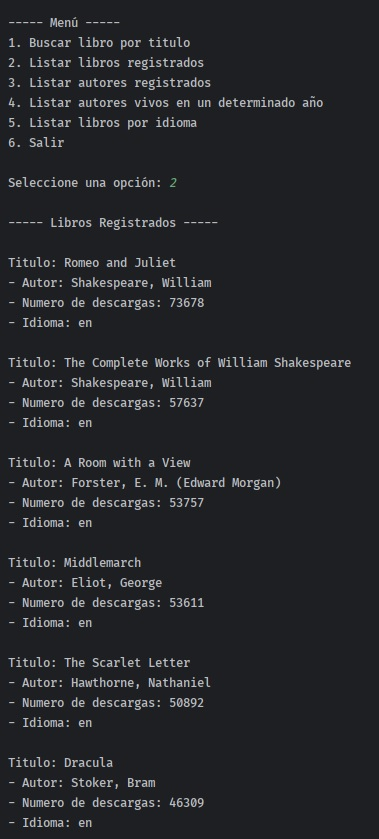
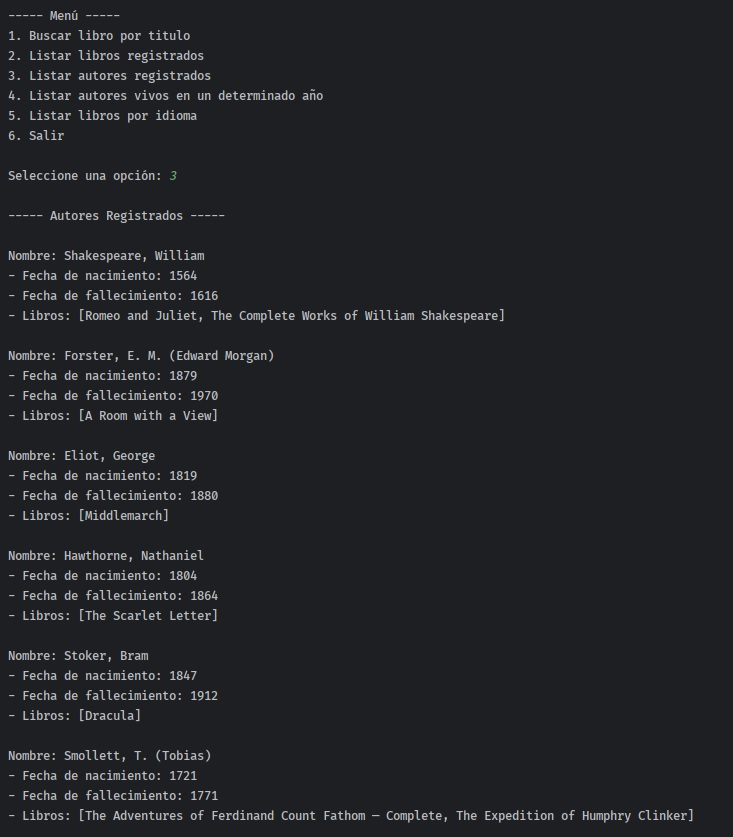
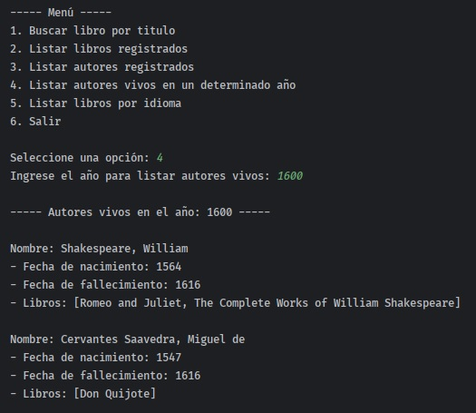
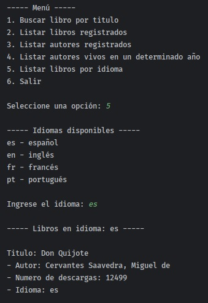
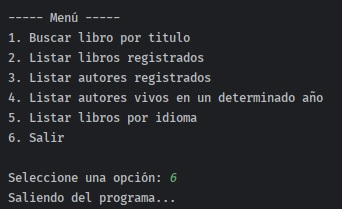

# LiterAlura
## _Programa de linea de comandos para gestionar libros y autores_
LiterAlura es un programa de linea de comandos que consume los datos de la API Gutendex y los guarda en una Base de Datos Relacional (PostgreSQL). Para luego recibir peticiones de un usuario y obtener los datos de la Base de Datos mostrando los datos por pantalla. 

## Caracteristicas
- Muestra un menu de opciones para que el usuario pueda elegir la opcion que solicite
- Consumo de los datos de la API Gutendex para posteriormente guardarlos en una Base de Datos 
- Utilizacion de clases record para modelar los datos obtenidos del json a objetos manejables dentro del programa
- Uso de dto´s para el manejo de datos creando objetos de ese tipo
- Uso de entidades para mapear las tablas de la base de datos y crear objetos para guardar los datos dentro de la Base de Datos
- Utilizacion de inyeccion de dependencias para crear las conexiones entre clases

## Estructura principal del proyecto
```
└── 📁src
    └── 📁main
        └── 📁java
            └── 📁com
                └── 📁nicode
                    └── 📁challenge_literalura
                        └── 📁dominio
                            └── 📁dtos
                                ├── AutorDto.java
                                ├── DatosAutor.java
                                ├── DatosCompletoLibro.java
                                ├── DatosLibro.java
                                ├── IdiomaEnum.java
                                ├── LibroDto.java
                            └── 📁servicios
                                ├── ApiServicio.java
                                ├── MenuServicio.java
                        └── 📁persistencia
                            └── 📁entidades
                                ├── Autor.java
                                ├── Libro.java
                            └── 📁repositorios
                                ├── AutorRepo.java
                                ├── LibroRepo.java
                        └── 📁util
                            ├── Conversor.java
                            ├── IConversor.java
                        └── ChallengeLiteraluraApplication.java
```

## Capturas del proyecto

### Menu principal


### Buscando libro por titulo


### Listando libros ya registrados en la base de datos


### Listando autores ya registrados en la base de datos


### Listando autores que se encuentran vivos en un determinado año


### Listando libros por idioma


### Terminando la ejecucion del programa


## Tecnologias
Tecnologias que se utilizaron para la creacion del programa:
- Java 17 
- Spring Boot
- Spring Data JPA
- Biblioteca de Jackson
- PostgreSQL
- API Gutendex
- Intellij IDEA

## Pasos a seguir
- Generar estadísticas: usando la clase DoubleSummaryStatistics, utilizada para obtener datos estadísticos de un objeto Java. Es posible obtener dichos datos ya sea de consultas de la API o base de datos.
- Top 10 libros más descargados: presentar los datos de los 10 libros más descargados, siendo una consulta directamente hecha en la API o en la base de datos.
- Buscar autor por nombre.
- Listar autores con otras consultas: Aquí dejamos como sugerencia implementar otras consultas con los atributos de año de nacimiento y fallecimiento de los autores.
- Cambiar la manera en la conversion entre clases entity y dto

